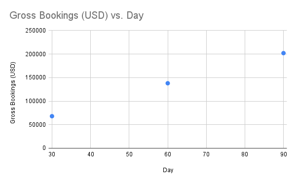

# Jeremy Ramey  
**Implementation | Integrations | Customer Success (Non-Engineering Portfolio)**

[LinkedIn](https://www.linkedin.com/in/jeremy-r-a57b98ab/) •  
[Email](mailto:jsr110187@gmail.com) •  
[Resume](assets/resume.pdf)

---

## Overview
I’m an Implementation, Integration, and Customer Success professional with experience leading **enterprise SaaS implementations**, supporting **integrations** (including Concur, SCIM, and SFTP roster automation), and driving **post-launch adoption** through structured onboarding and KPI tracking.

This is **not a software engineering portfolio**.  
This portfolio is designed to help **recruiters and hiring managers** understand how I run implementations, partner cross-functionally, and deliver outcomes after launch.

All examples are **sanitized, anonymized, and non-confidential**.

---

## What I Do
- Lead end-to-end onboarding from kickoff through launch  
- Partner with Sales, Product, Engineering, and Customer Success  
- Support integrations and system readiness  
- Drive adoption through enablement, communication, and metrics  
- Identify risk early and course-correct before escalation

---

## Featured Case Studies

## Hero Case Study — Global, Decentralized Travel + Meals Rollout (Enterprise)

### Problem
A global organization needed a decentralized rollout for **business travel and meals**. Key pain points included high-cost airport transportation patterns (e.g., black car usage) and the need to drive adoption across multiple business units without a single centralized owner.

### Environment
- **Program type:** Global, decentralized travel + meals
- **Existing ecosystem:** TripActions for self-booking, corporate cards, and expense workflows
- **Integration complexity:** First-time **SCIM provisioning** using **OneLogin**
- **Rollout strategy:** Phased launch with end-user activation focus

### What I Did (Actions)
- **Built the business case with spend insights:** surfaced cost-saving opportunity by comparing higher-cost ground transportation patterns against a lower-cost alternative.
- **Aligned stakeholders on rollout approach:** clarified decentralized ownership and established a weekly operating cadence (status updates, risks, decisions).
- **Led SCIM provisioning readiness:** partnered with IT to validate user lifecycle requirements (create/update/deactivate), required attributes, and ownership expectations.
- **Managed launch-day execution:** coordinated go-live steps, monitored provisioning and user access in real time, and worked cross-functionally to troubleshoot issues quickly.
- **Drove activation strategy:** launched a **$20 linking incentive** and prepared post-launch office hours to accelerate adoption and reduce confusion.

### Technical Components (High-Level)
- **SCIM provisioning via OneLogin**
  - User lifecycle events: create / update / deactivate
  - Attribute mapping and ownership alignment
  - Go-live validation and issue triage
- **Workflow coordination with existing travel/expense tools**
  - Ensured program fit alongside established self-booking and expense processes

### Outcomes (Sanitized)
- **Linkage:** ~22% early linkage following launch + incentive
- **Commercial impact:** ~$202K gross bookings within ~90 days (trend increasing)
- **Operational readiness:** Successful first-time SCIM provisioning go-live with launch-day risk managed through rapid cross-functional troubleshooting

#### Adoption & Commercial Impact (First 90 Days)

*By implementing SCIM roster automation at launch, we eliminated manual provisioning delays, enabling faster user access and materially improving early adoption rates. Increased executive access to premium transportation options and adjusted meal policy permissions further translated adoption into sustained commercial impact.*

### Learnings
- Adoption improves when the value story is tied to **real spend patterns**, not generic benefits.
- First-time SCIM go-lives succeed when ownership is explicit: **who owns data quality, lifecycle events, and exception handling**.
- “Office hours” post-launch reduces friction and keeps decentralized programs moving.
---

### Concur Integration Rollout
**Problem:**  
Finance teams required clean expense reconciliation and reduced manual workflows.

**What I Did:**  
Aligned finance stakeholders on success criteria, coordinated integration readiness, supported testing, and guided post-launch monitoring.

**Outcome:**  
Improved reconciliation clarity and reduced post-launch confusion.

---

### SCIM / SFTP Roster Automation
**Problem:**  
Manual user provisioning created administrative overhead and access delays.

**What I Did:**  
Defined provisioning ownership, aligned required data fields, coordinated automation setup, and documented lifecycle expectations.

**Outcome:**  
Reduced manual admin work and improved access consistency.

---

### Post-Launch Adoption Recovery
**Problem:**  
Adoption slowed after launch, putting long-term program success at risk.

**What I Did:**  
Identified adoption drop-off points, delivered targeted enablement, and reset success milestones.

**Outcome:**  
Renewed adoption momentum and improved program confidence.

---

## Example Pseudo-Flows

### Implementation Lifecycle
Sales Close  
↓  
Kickoff & Discovery  
↓  
Configuration & Integration Readiness  
↓  
Training & Enablement  
↓  
Go-Live  
↓  
Adoption Monitoring

---

### SCIM Provisioning (Conceptual)
Identity Provider (Okta / Azure AD)  
↓  
SCIM Trigger (Create / Update / Deactivate)  
↓  
User Access Updated Automatically  
↓  
Reduced Manual Admin Work

---

## Tools & Systems (High-Level)
- Uber for Business  
- Concur  
- SCIM / SFTP roster automation  
- Enterprise onboarding workflows  
- Adoption and KPI tracking frameworks

---

## Contact
If you’re reviewing me for **Implementation Manager, Integration Specialist, or Technical Customer Success** roles, I’d welcome a conversation.

[LinkedIn](https://www.linkedin.com/in/jeremy-r-a57b98ab/) •  
[Email](mailto:jsr110187@gmail.com)
